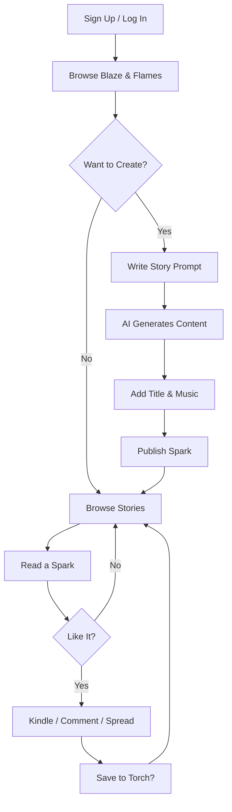

# SCOOPS - Product Requirements Document

> A social storytelling platform where users share AI-powered micro-stories with music

---

## Glossary (Unique Platform Terminology)

| Term | What It Means | Why This Name |
|------|---------------|---------------|
| **Spark** | A single story post | A creative spark, the beginning of something big |
| **Blaze** | Trending/popular stories section | Sparks that caught fire and are burning bright |
| **Flame** | Story category/theme/genre | Different flames for different moods |
| **Torch** | User's saved stories collection | Keeping the flame alive for later |
| **Kindle** | Likes on a story | Fueling someone's creative fire |
| **Spread** | Share a story | Spreading the fire to others |

---

## What Is Scoops?

Scoops is a web app where people share short stories (max 120 words) enhanced by AI. Think of it as Twitter meets creative writing, with a musical twist.

### The Core Idea

1. **You write a story prompt** - give us the vibe, theme, or starting idea
2. **AI helps you craft it** - generates or enhances your story
3. **Add music** - pick a track that sets the mood
4. **Share your Spark** - publish it for the world to see
5. **Engage with others** - like (kindle), comment, share (spread), and save to your torch

---

## Key Features

### 1. User Accounts
- Sign up with email and password
- Log in securely with JWT tokens
- Personal profile page showing your sparks and saved stories

### 2. Creating Sparks (Posts)
- **Title**: Catchy headline for your story
- **Story**: AI-assisted content (max 120 words)
- **Music**: Background track URL or selection
- Each spark gets a unique ID for sharing

### 3. Social Interactions
- **Kindle** (Likes): Show love for a story
- **Comments**: Share your thoughts
- **Spread** (Share): Spread stories to others
- **Save to Torch**: Bookmark stories for later

### 4. Blaze (Trending Section)
- Displays the hottest sparks based on:
  - Number of kindles (likes)
  - Comment activity
  - Share count
  - Recency factor
- Updates in real-time or near real-time

### 5. Flames (Categories)
- Stories are grouped by theme/genre
- Examples: Romance, Horror, Sci-Fi, Humor, Drama, Mystery
- Users can browse by flame to find stories they'll enjoy

### 6. Search & Discovery
- Search stories by keywords
- Search users by username
- Filter by flavor (category)

### 7. Notifications
- Get notified when someone:
  - Kindles your spark
  - Comments on your story
  - Spreads your content

### 8. Analytics (For Users)
- See how your sparks are performing
- Track engagement over time

---

## Tech Stack

| Layer | Technology | Purpose |
|-------|------------|---------|
| **Frontend** | React.js | Interactive user interface |
| **Backend** | Node.js + Express.js | API server and business logic |
| **Database** | MongoDB | Store users, scoops, interactions |
| **Auth** | JWT (JSON Web Tokens) | Secure login sessions |
| **AI** | OpenAI GPT API | Story generation and enhancement |
| **Hosting** | Heroku / AWS / DigitalOcean | Production deployment |
| **Version Control** | Git + GitHub | Code management |
| **Testing** | Jest, React Testing Library, Mocha | Automated tests |
| **CI/CD** | GitHub Actions | Automated builds and deploys |

---

## Development Workflow

```
1. Planning     → Define features, create designs
2. Backend      → Build APIs and database
3. Frontend     → Build UI components
4. AI Setup     → Integrate GPT for story generation
5. Testing      → Write and run tests
6. Deploy       → Launch to production
7. Iterate      → Gather feedback, improve
```

---

## User Journey Flow



---

## API Endpoints

### Authentication
| Method | Endpoint | Description |
|--------|----------|-------------|
| POST | `/api/auth/register` | Create new account |
| POST | `/api/auth/login` | Log in, get JWT token |
| POST | `/api/auth/logout` | Invalidate session |
| GET | `/api/auth/me` | Get current user info |

### Sparks (Posts)
| Method | Endpoint | Description |
|--------|----------|-------------|
| POST | `/api/sparks` | Create new spark (with AI) |
| GET | `/api/sparks` | Get all sparks (paginated) |
| GET | `/api/sparks/:id` | Get single spark by ID |
| PUT | `/api/sparks/:id` | Update your spark |
| DELETE | `/api/sparks/:id` | Delete your spark |

### Interactions
| Method | Endpoint | Description |
|--------|----------|-------------|
| POST | `/api/sparks/:id/kindle` | Like a spark |
| DELETE | `/api/sparks/:id/kindle` | Unlike a spark |
| POST | `/api/sparks/:id/comments` | Add comment |
| GET | `/api/sparks/:id/comments` | Get comments |
| DELETE | `/api/comments/:id` | Delete your comment |
| POST | `/api/sparks/:id/spread` | Share a spark |

### Blaze (Trending)
| Method | Endpoint | Description |
|--------|----------|-------------|
| GET | `/api/blaze` | Get trending sparks |
| GET | `/api/blaze/daily` | Today's top sparks |
| GET | `/api/blaze/weekly` | This week's top sparks |

### Flames (Categories)
| Method | Endpoint | Description |
|--------|----------|-------------|
| GET | `/api/flames` | List all flames |
| GET | `/api/flames/:slug/sparks` | Get sparks by flame |
| POST | `/api/flames` | Create flame (admin) |

### User Profile & Torch
| Method | Endpoint | Description |
|--------|----------|-------------|
| GET | `/api/users/:username` | Get user profile |
| GET | `/api/users/:username/sparks` | Get user's sparks |
| GET | `/api/me/torch` | Get saved sparks |
| POST | `/api/me/torch/:sparkId` | Save spark to torch |
| DELETE | `/api/me/torch/:sparkId` | Remove from torch |
| PUT | `/api/me/profile` | Update profile |
| DELETE | `/api/me/account` | Delete account |

### Search
| Method | Endpoint | Description |
|--------|----------|-------------|
| GET | `/api/search/sparks?q=` | Search stories |
| GET | `/api/search/users?q=` | Search users |

### Notifications
| Method | Endpoint | Description |
|--------|----------|-------------|
| GET | `/api/notifications` | Get user notifications |
| PUT | `/api/notifications/:id/read` | Mark as read |
| PUT | `/api/notifications/read-all` | Mark all as read |

### Analytics
| Method | Endpoint | Description |
|--------|----------|-------------|
| GET | `/api/me/analytics` | Get your engagement stats |

---

## Database Schemas

### User Model
```javascript
const mongoose = require('mongoose');

const UserSchema = new mongoose.Schema({
    username: { 
        type: String, 
        required: true, 
        unique: true,
        minlength: 3,
        maxlength: 30
    },
    email: { 
        type: String, 
        required: true, 
        unique: true 
    },
    password: { 
        type: String, 
        required: true 
    },
    displayName: {
        type: String,
        maxlength: 50
    },
    bio: {
        type: String,
        maxlength: 160
    },
    avatar: {
        type: String  // URL to profile image
    },
    torch: [{  // Saved sparks
        type: mongoose.Schema.Types.ObjectId, 
        ref: 'Spark' 
    }],
    createdAt: { 
        type: Date, 
        default: Date.now 
    }
});

module.exports = mongoose.model('User', UserSchema);
```

### Spark Model (Post)
```javascript
const mongoose = require('mongoose');

const SparkSchema = new mongoose.Schema({
    author: {
        type: mongoose.Schema.Types.ObjectId,
        ref: 'User',
        required: true
    },
    title: { 
        type: String, 
        required: true,
        maxlength: 100 
    },
    story: { 
        type: String, 
        required: true,
        maxlength: 700  // ~120 words
    },
    music: { 
        type: String  // URL to music track
    },
    flame: {
        type: mongoose.Schema.Types.ObjectId,
        ref: 'Flame'
    },
    kindleCount: {
        type: Number,
        default: 0
    },
    commentCount: {
        type: Number,
        default: 0
    },
    spreadCount: {
        type: Number,
        default: 0
    },
    createdAt: { 
        type: Date, 
        default: Date.now 
    },
    updatedAt: { 
        type: Date, 
        default: Date.now 
    }
});

module.exports = mongoose.model('Spark', SparkSchema);
```

### Interaction Model
```javascript
const mongoose = require('mongoose');

const InteractionSchema = new mongoose.Schema({
    spark: { 
        type: mongoose.Schema.Types.ObjectId, 
        ref: 'Spark', 
        required: true 
    },
    user: { 
        type: mongoose.Schema.Types.ObjectId, 
        ref: 'User', 
        required: true 
    },
    type: { 
        type: String, 
        enum: ['kindle', 'comment', 'spread'], 
        required: true 
    },
    commentText: { 
        type: String,
        maxlength: 500
    },
    createdAt: { 
        type: Date, 
        default: Date.now 
    }
});

// Prevent duplicate kindles
InteractionSchema.index({ spark: 1, user: 1, type: 1 }, { unique: true });

module.exports = mongoose.model('Interaction', InteractionSchema);
```

### Flame Model (Category)
```javascript
const mongoose = require('mongoose');

const FlameSchema = new mongoose.Schema({
    name: { 
        type: String, 
        required: true,
        unique: true
    },
    slug: {
        type: String,
        required: true,
        unique: true
    },
    description: { 
        type: String,
        maxlength: 200
    },
    color: {
        type: String  // Hex color for UI
    },
    icon: {
        type: String  // Emoji or icon name
    },
    sparkCount: {
        type: Number,
        default: 0
    },
    createdAt: { 
        type: Date, 
        default: Date.now 
    }
});

module.exports = mongoose.model('Flame', FlameSchema);
```

### Notification Model
```javascript
const mongoose = require('mongoose');

const NotificationSchema = new mongoose.Schema({
    recipient: {
        type: mongoose.Schema.Types.ObjectId,
        ref: 'User',
        required: true
    },
    sender: {
        type: mongoose.Schema.Types.ObjectId,
        ref: 'User'
    },
    type: {
        type: String,
        enum: ['kindle', 'comment', 'spread', 'follow', 'system'],
        required: true
    },
    spark: {
        type: mongoose.Schema.Types.ObjectId,
        ref: 'Spark'
    },
    message: {
        type: String
    },
    read: {
        type: Boolean,
        default: false
    },
    createdAt: {
        type: Date,
        default: Date.now
    }
});

module.exports = mongoose.model('Notification', NotificationSchema);
```

---

## Development Task Checklist

### Phase 1: Project Setup
- [ ] Initialize Node.js project with Express
- [ ] Set up MongoDB connection
- [ ] Configure environment variables (.env)
- [ ] Set up project folder structure
- [ ] Install core dependencies (express, mongoose, jsonwebtoken, bcrypt, cors)
- [ ] Set up React frontend with Create React App or Vite
- [ ] Configure ESLint and Prettier

### Phase 2: Authentication System
- [ ] Create User model with validation
- [ ] Build registration endpoint (POST /api/auth/register)
- [ ] Build login endpoint (POST /api/auth/login)
- [ ] Implement JWT token generation
- [ ] Create auth middleware for protected routes
- [ ] Build password hashing with bcrypt
- [ ] Add email validation
- [ ] Create frontend login page
- [ ] Create frontend registration page
- [ ] Implement token storage (localStorage/cookies)

### Phase 3: Spark (Post) Management
- [ ] Create Spark model with validation
- [ ] Build create spark endpoint (POST /api/sparks)
- [ ] Integrate OpenAI API for story generation
- [ ] Build get all sparks endpoint with pagination
- [ ] Build get single spark endpoint
- [ ] Build update spark endpoint
- [ ] Build delete spark endpoint
- [ ] Add 120-word limit validation
- [ ] Create frontend spark creation form
- [ ] Create frontend spark display component
- [ ] Create frontend spark list/feed view

### Phase 4: Interactions (Kindles, Comments, Spreads)
- [ ] Create Interaction model
- [ ] Build kindle (like) endpoint
- [ ] Build un-kindle endpoint
- [ ] Build add comment endpoint
- [ ] Build get comments endpoint
- [ ] Build delete comment endpoint
- [ ] Build spread (share) endpoint
- [ ] Update spark counts on interactions
- [ ] Create frontend kindle button component
- [ ] Create frontend comment section
- [ ] Create frontend spread functionality

### Phase 5: Blaze (Trending)
- [ ] Build trending algorithm (kindles + comments + recency)
- [ ] Build blaze endpoint
- [ ] Add daily/weekly filters
- [ ] Create frontend trending section
- [ ] Add real-time or periodic updates

### Phase 6: Flames (Categories)
- [ ] Create Flame model
- [ ] Build get all flames endpoint
- [ ] Build get sparks by flame endpoint
- [ ] Seed initial flames (Romance, Horror, Sci-Fi, etc.)
- [ ] Create frontend flame selector
- [ ] Create frontend flame browse page

### Phase 7: User Profiles & Torch
- [ ] Build get user profile endpoint
- [ ] Build get user's sparks endpoint
- [ ] Build save to torch endpoint
- [ ] Build remove from torch endpoint
- [ ] Build update profile endpoint
- [ ] Build delete account endpoint
- [ ] Create frontend profile page
- [ ] Create frontend torch (saved) page
- [ ] Add avatar upload functionality

### Phase 8: Search & Discovery
- [ ] Build search sparks endpoint
- [ ] Build search users endpoint
- [ ] Add search indexing for performance
- [ ] Create frontend search bar
- [ ] Create frontend search results page

### Phase 9: Notifications
- [ ] Create Notification model
- [ ] Build notification creation logic
- [ ] Build get notifications endpoint
- [ ] Build mark as read endpoints
- [ ] Create frontend notification dropdown
- [ ] Add real-time notifications (WebSocket/polling)

### Phase 10: Testing
- [ ] Write unit tests for auth routes
- [ ] Write unit tests for spark routes
- [ ] Write unit tests for interaction routes
- [ ] Write integration tests for API
- [ ] Write frontend component tests
- [ ] Set up test database
- [ ] Achieve 70%+ code coverage

### Phase 11: Deployment
- [ ] Set up production MongoDB (Atlas)
- [ ] Configure production environment variables
- [ ] Set up Heroku/AWS/DigitalOcean
- [ ] Configure CI/CD with GitHub Actions
- [ ] Set up SSL certificate
- [ ] Configure CORS for production
- [ ] Run production smoke tests

### Phase 12: Polish & Launch
- [ ] Add loading states and error handling
- [ ] Implement responsive design
- [ ] Add accessibility features (ARIA labels)
- [ ] Optimize images and assets
- [ ] Add rate limiting
- [ ] Set up error logging (Sentry)
- [ ] Write user documentation
- [ ] Create landing page
- [ ] Launch!

---

## Non-Functional Requirements

| Requirement | Target |
|-------------|--------|
| Page load time | < 3 seconds |
| API response time | < 500ms |
| Uptime | 99% |
| Mobile responsive | Yes |
| Browser support | Chrome, Firefox, Safari, Edge (last 2 versions) |
| Security | HTTPS, password hashing, JWT expiry |

---

## Future Enhancements (Post-MVP)

- [ ] OAuth login (Google, GitHub)
- [ ] Music integration (Spotify API)
- [ ] Story audio narration (text-to-speech)
- [ ] User following system
- [ ] Direct messaging
- [ ] Story collaborations
- [ ] Premium features / monetization
- [ ] Mobile app (React Native)

